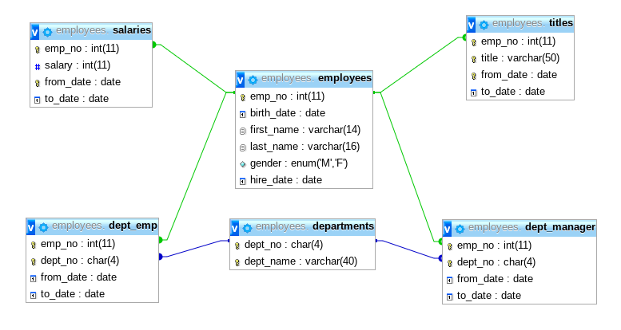
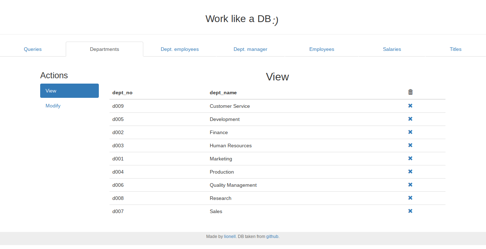
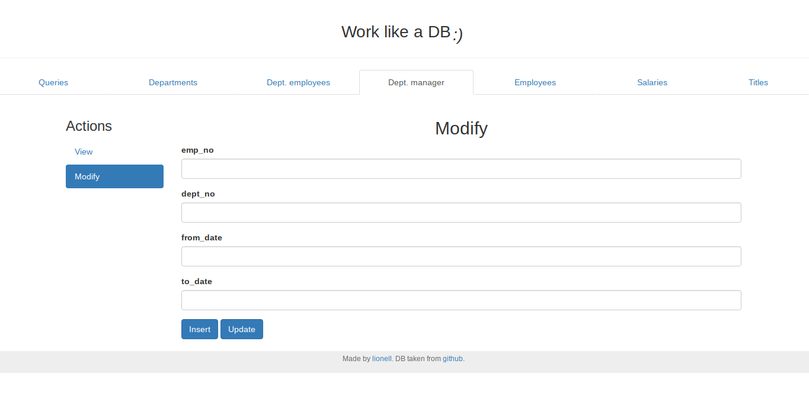
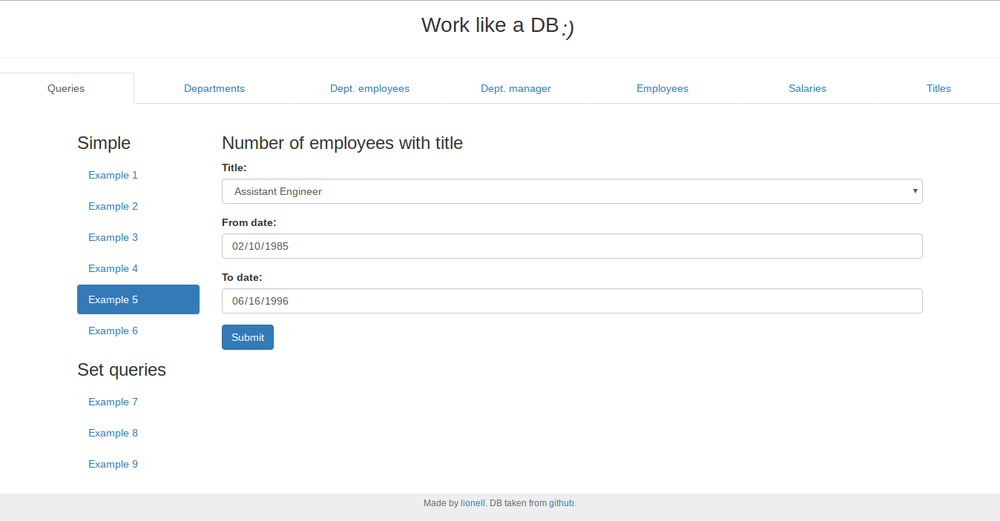
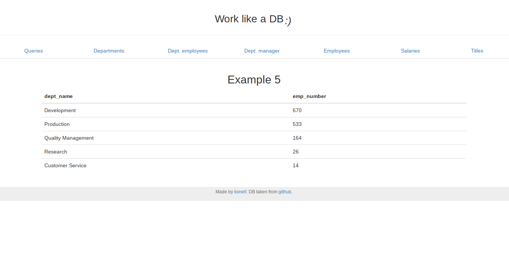

# Work like a DB :)

This is site based on test DB, to run some example SQL queries.

Based on [test\_db](https://github.com/datacharmer/test_db).

## How to use

Site is divided into *two different parts* as tables, queries.

### Tables

Here is DB scheme:



You are able to view content of particular table, insert new data into it, update
existing data or delete it.

Here is how `departments` table looks like:



You can **delete** some rows from table by clicking on 'X' icon in 'trash' column.

To **insert** or **update** rows you should go to tab called 'Modify' on the right side.
You will be asked to enter some information neccessary to process queries.



**NOTE!** You need to fill all the fields with values to make modification.

### Queries

There are 6 simple queries and 3 set comparison queries provided as examples.
To run query you need to go to tab called 'Queries' and select query you want to run.

Let's have a look at example query 5.



As you can see queries are parametrized. In this particular case we need to provide
title, start and end date to get number of coworkers with given title per department.

Fortunatelly, **default values are good enough** to run this query, so let's try it.



To get back to 'Queries' page you can always use top navigation bar.

That's it for now. Hope this example is useful :)

## Example queries

**NOTE!** All the queries as parametrized with date window `[from_date, to_date]`.

1. Select employees of `{$gender}` and their salaries.

	```sql
	SELECT first_name, last_name, gender, average_salary
	FROM employees
		JOIN (SELECT emp_no, AVG(salary) AS average_salary
				FROM salaries
				WHERE from_date >= '{$from_date}' AND to_date <= '{$to_date}'
				GROUP BY emp_no
			) AS emp_salary
			ON employees.emp_no = emp_salary.emp_no
	WHERE gender = '{$gender}'
	ORDER BY average_salary DESC
	LIMIT 20;
	```

2. Select managers by department.

	```sql
	SELECT dept_name, first_name, last_name, from_date, to_date
	FROM departments
		JOIN dept_manager
			ON departments.dept_no = dept_manager.dept_no
		JOIN employees
			ON dept_manager.emp_no = employees.emp_no
	WHERE from_date >= '{$from_date}' AND to_date <= '{$to_date}'
	ORDER BY dept_name
	LIMIT 20;
	```

3. Get average salary per title.

	```sql
	SELECT title, AVG(avg_salary) AS average_salary
	FROM titles
		JOIN (SELECT emp_no, AVG(salary) AS avg_salary
				FROM salaries
				WHERE from_date >= '{$from_date}' AND to_date <= '{$to_date}'
				GROUP BY emp_no
			) AS emp_avg
			ON titles.emp_no = emp_avg.emp_no
	GROUP BY title
	ORDER BY average_salary DESC
	LIMIT 20;
	```

4. Minimal salary of employee with `{$emp_no}`.

	```sql
	SELECT first_name, last_name, min_salary
	FROM employees
		JOIN (SELECT emp_no, MIN(salary) AS min_salary
				FROM salaries
				WHERE from_date >= '{$from_date}' AND to_date <= '{$to_date}'
				GROUP BY emp_no
			) AS emp_min_salary
			ON employees.emp_no = emp_min_salary.emp_no
	ORDER BY min_salary
	LIMIT 20;
	```

5. Number of employees with `{$title}` per department.

	```sql
	SELECT dept_name, COUNT(dept_emp.emp_no) AS emp_number
	FROM departments
		JOIN dept_emp
			ON departments.dept_no = dept_emp.dept_no
		JOIN titles
			ON titles.emp_no = dept_emp.emp_no
	WHERE dept_emp.from_date >= '{$from_date}' AND dept_emp.to_date <= '{$to_date}'
			AND titles.from_date >= '{$from_date}' AND titles.to_date <= '{$to_date}'
			AND title = '{$title}'
	GROUP BY dept_name
	ORDER BY emp_number DESC
	LIMIT 20;
	```
6. List titles of particular employee with `{$emp_no}`.

	```sql
	SELECT title, from_date, to_date
	FROM titles
	WHERE from_date >= '{$from_date}' AND to_date <= '{$to_date}'
		AND emp_no = '{$emp_no}'
	ORDER BY from_date DESC
	LIMIT 20;
	```

## Set comparisons

7. Employees with some titles of `{$emp_no}`.

	```sql
	SELECT titles.emp_no, first_name, last_name, title, from_date, to_date
	FROM employees
		JOIN titles
			ON employees.emp_no = titles.emp_no
	WHERE from_date >= '{$from_date}' AND to_date <= '{$to_date}'
		AND title
		IN (SELECT title
			FROM titles
			WHERE from_date >= '{$from_date}' AND to_date <= '{$to_date}'
				AND emp_no = '{$emp_no}'
		)
	ORDER BY titles.emp_no
	LIMIT 20;
	```

8. Employees working at the same department as `{$emp_no}`.

	```sql
	SELECT dept_emp.emp_no, first_name, last_name, dept_emp.dept_no, from_date, to_date
	FROM dept_emp
		JOIN employees
			ON dept_emp.emp_no = employees.emp_no
	WHERE from_date >= '{$from_date}' AND to_date <= '{$to_date}'
		AND dept_no 
		IN (SELECT dept_no
			FROM dept_emp
			WHERE from_date >= '{$from_date}' AND to_date <= '{$to_date}'
				AND emp_no = '{$emp_no}'
		)
	ORDER BY dept_emp.emp_no
	LIMIT 20;
	```

9. Find employees managed by some of managers of `{$emp_no}`.

	```sql
	SELECT dept_manager.emp_no, first_name, last_name, dept_manager.dept_no, from_date, to_date
	FROM dept_manager
		JOIN employees
			ON dept_manager.emp_no = employees.emp_no
	WHERE from_date >= '{$from_date}' AND to_date <= '{$to_date}'
		AND dept_no 
		IN (SELECT dept_no
			FROM dept_manager
			WHERE from_date >= '{$from_date}' AND to_date <= '{$to_date}'
				AND emp_no = '{$emp_no}'
		)
	ORDER BY dept_manager.emp_no
	LIMIT 20;
	```

## How to install

1. Clone the repo somewhere on your disk.

	```shell
	$ git clone https://github.com/lionell/labs.git
	```
2. If you have LAMP server running on you machine, just copy the site directory to your serving 
	directory

	```shell
	$ cp labs/db /path/to/your/serving/directory
	```
3. Otherwise you can use Docker LAMP images to host site.

	```shell
	$ docker run -p 8000:80 -p 2200:22 -p 3306:3306 -v $(pwd)/labs/db:/var/www/html:rw dockie/lamp
	```

	Now it should be availabel at `localhost:8000`

	See Dockerfile here: https://github.com/RobLoach/Dockie/tree/master/lamp

## DISCLAIMER

To the best of my knowledge, this data is fabricated, and
it does not correspond to real people. 
Any similarity to existing people is purely coincidental.

## LICENSE
This work is licensed under the 
Creative Commons Attribution-Share Alike 3.0 Unported License. 
To view a copy of this license, visit 
http://creativecommons.org/licenses/by-sa/3.0/ or send a letter to 
Creative Commons, 171 Second Street, Suite 300, San Francisco, 
California, 94105, USA.

